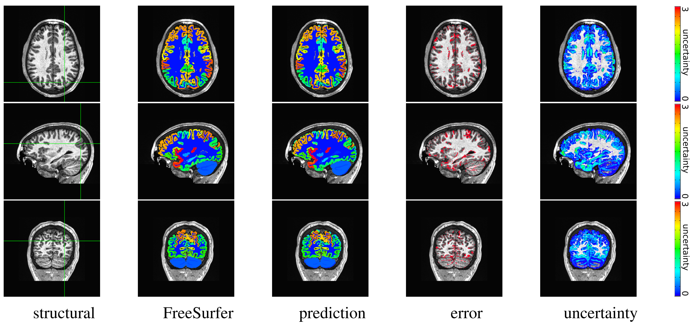

# kwyk
Knowing what you know - Bayesian Neural Network for brain parcellation and uncertainty estimation

Paper, code, and model corresponding to [preprint](https://arxiv.org/abs/1812.01719), which is now published.

Cite: [McClure P, Rho N, Lee JA, Kaczmarzyk JR, Zheng CY, Ghosh SS, Nielson DM, Thomas AG, Bandettini P and Pereira F (2019) Knowing What You Know in Brain Segmentation Using Bayesian Deep Neural Networks. Front. Neuroinform. 13:67. doi:10.3389/fninf.2019.00067](https://www.frontiersin.org/articles/10.3389/fninf.2019.00067/full)

 <sub>__Figure__: In-site segmentation results for the spike-and-slab dropout (SSD) network for a test subject with average Dice performance. The columns show, respectively, the structural image used as input, the FreeSurfer segmentation used as a prediction target, the prediction made by our network, the voxels where there was a mismatch between prediction and target, and the prediction uncertainty at each voxel.</sub>

To run using singularity, first pull the image:

```
singularity pull docker://neuronets/kwyk:latest-gpu
```

You have a few options when running the image. To see them call help.
```
singularity run -B $(pwd):/data -W /data --nv kwyk_latest-gpu.sif --help
```

The models correspond to:
1. Spike-and-slab dropout (bvwn_multi_prior)
2. MC Bernoulli dropout (bwn_multi)
3. MAP (bwn)

Here is an example with the spike and slab dropout.
```
singularity run -B $(pwd):/data -W /data --nv kwyk_latest-gpu.sif -m bvwn_multi_prior -n 2 \
  --save-variance --save-entropy T1_001.nii.gz output
```

Note: If you already have `FREESURFER` environment variables in your shell, these may interfere with the ones inside the container. To isolate the container further please add the `-e` flag at the beginning (`singularity run -e ...`) to suppress any environment variables from being pulled into the container.

This will generate two sets of files `output_*.nii.gz` and `output_*_orig.nii.gz`. The first set consists of results in conformed FreeSurfer space. The second set will correspond to the original input space.

1. `output_means`: This file contains the labels
2. `output_variance`: This file contains the variance in labeling over multiple samplings.
3. `output_entropy`: This file contains the estimated entropy at each voxel.
4. `output_uncertainty`: A json file that contains the average uncertainty of the input.

For now, if output files exist, the program will not override them.

### Docker usage example

Instead of singularity with GPU, once can also use docker directly. This is an example with a CPU. Note that the CPU-based run is significantly slower.

```
docker run -it --rm -v $(pwd):/data neuronets/kwyk:latest-cpu -m bvwn_multi_prior \
  --save-entropy T1_001.nii.gz output
```

The above examples assume there is a file named `T1_001.nii.gz` in `$(pwd)`.

### Docker hub tags

The docker hub tags follow the following naming scheme:

- `master-gpu`: gpu version of current github master
- `latest-gpu`: gpu version of latest release
- `SEMVER-gpu`: gpu version of semantically versioned release

for `cpu` versions replace `gpu` with `cpu`

# nobrainer

This model is based on an earlier version of the nobrainer framework. This repository will be updated when the code is transitioned to the new model.
